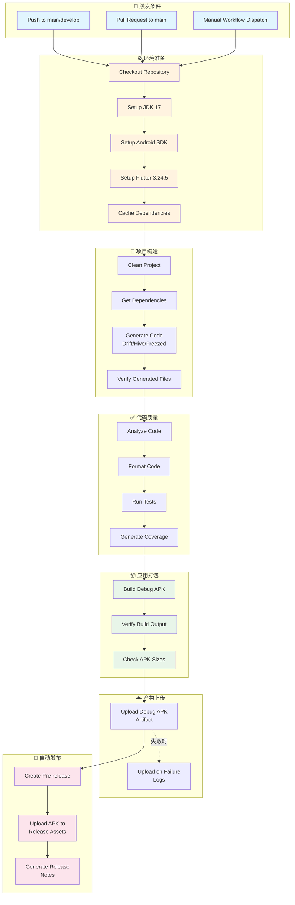

# GitHub Actions CI/CD 流程图

## 整体流程

---

## 详细步骤说明

### 1. 触发条件
- **Push 到 main/develop 分支**: 代码推送时自动触发
- **Pull Request 到 main**: PR 创建或更新时触发
- **手动触发**: 通过 GitHub 网页手动运行

### 2. 环境准备
- 检出代码仓库
- 安装 JDK 17 (Java 开发环境)
- 安装 Android SDK (安卓开发环境)
- 安装 Flutter 3.24.5 (跨平台开发框架)
- 缓存依赖以加速后续构建

### 3. 项目构建
- 清理之前的构建产物
- 获取 Flutter 依赖包
- 生成代码 (Drift 数据库、Hive 存储、Freezed 数据类)
- 验证生成的文件是否存在

### 4. 代码质量
- 静态代码分析
- 代码格式化检查
- 运行单元测试
- 生成测试覆盖率报告

### 5. 应用打包
- 构建 Debug 版本的 APK 文件
- 验证构建输出
- 检查 APK 文件大小

### 6. 产物上传
- 上传 APK 文件作为构建产物
- 构建失败时上传日志文件

### 7. 自动发布
- 创建预发布版本 (Pre-release)
- 上传 APK 到 Release 资产
- 生成详细的发布说明

---

## 构建产物

构建完成后，你可以在以下位置找到 APK 文件：

1. **GitHub Actions Artifacts**: 在 Actions 页面下载
2. **GitHub Releases**: 在 Releases 页面下载
3. **构建日志**: 构建失败时可查看详细日志

---

## 故障排查

### 常见问题

1. **构建失败**: 检查 Flutter 版本、依赖版本是否兼容
2. **代码生成失败**: 确保 `build_runner` 正确配置
3. **APK 未生成**: 检查 Android SDK 是否正确安装
4. **发布失败**: 检查 GitHub Token 权限是否正确

### 调试步骤

1. 查看 GitHub Actions 日志
2. 本地运行相同命令测试
3. 检查依赖版本兼容性
4. 验证环境配置是否正确

---

## 总结

这个 CI/CD 流程实现了：

✅ **自动化构建** - 代码推送自动触发构建  
✅ **代码质量检查** - 静态分析、测试、覆盖率  
✅ **多架构支持** - 支持 arm64、armeabi-v7a、x86_64  
✅ **自动发布** - 构建完成自动创建 Release  
✅ **故障排查** - 详细的日志和错误信息  

这个流程确保了代码质量和构建可靠性，让开发者可以专注于功能开发，而不必担心构建和发布的问题。